# TTH System Design Diagrams (Overview to Detailed Components)

This document visualizes the full system design for both:
1. Hybrid mode (`api` + `self_host` mix).
2. API-only mode (run locally on MacBook, no local model serving).

Diagram depth:
1. Section 0: lean v1 single-service baseline (primary implementation target).
2. Sections 1 to 11: system overview and end-to-end behavior.
3. Sections 12 to 21: detailed component design before implementation.

## 0) Lean v1 Single-Service Topology (Primary)
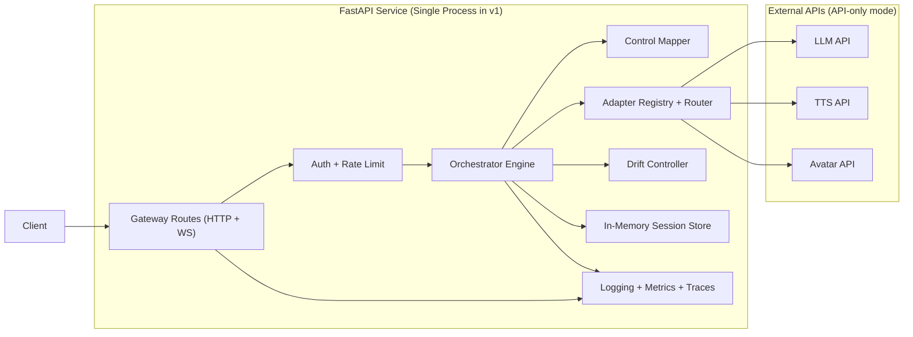

## 1) High-Level Architecture (Hybrid + API-only Compatible)
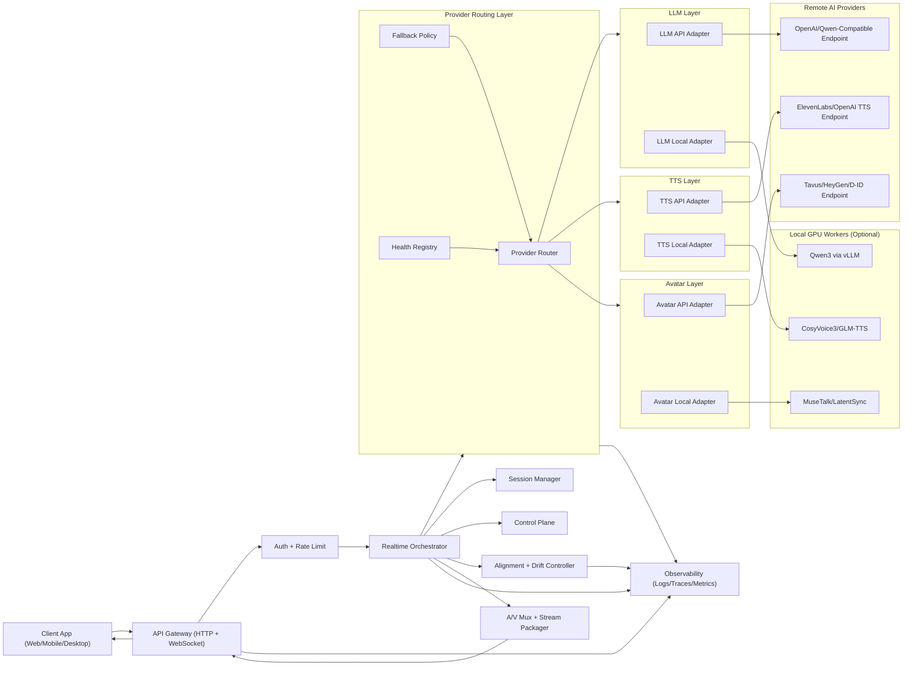

## 2) Component Decomposition
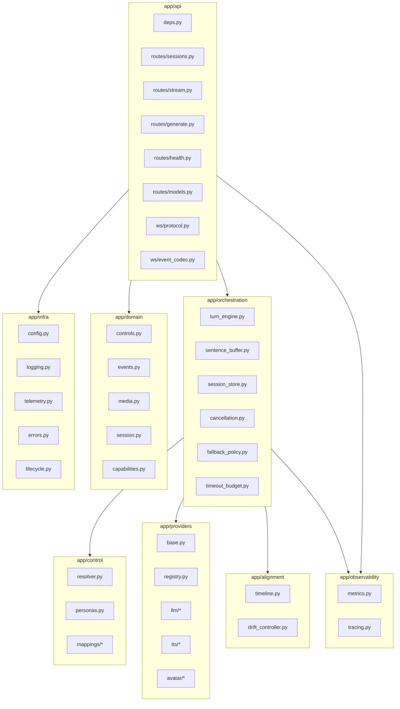

## 3) Realtime Sequence (API-only Split Mode)
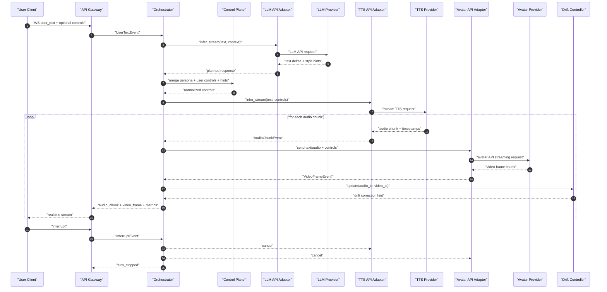

## 4) Realtime Sequence (API-only Managed Avatar Mode)
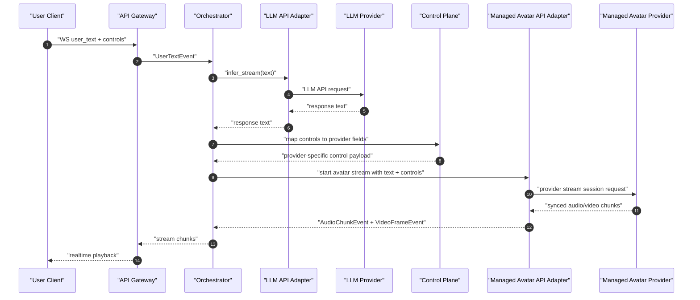

## 5) Orchestrator Internals (Turn Engine)
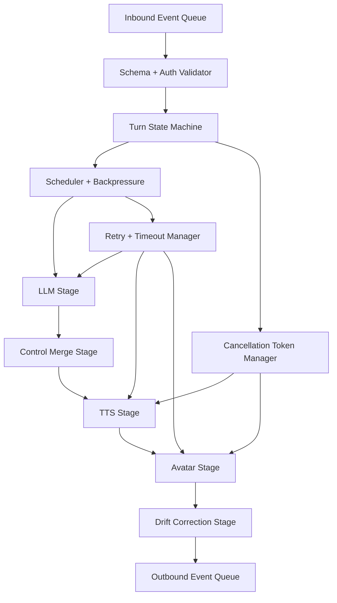

## 6) Control Plane Mapping Design
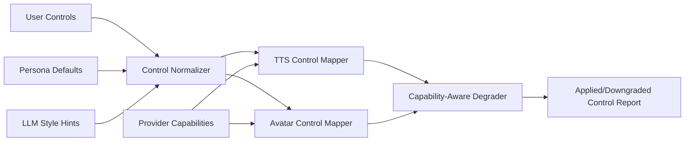

## 7) Provider Routing and Failover
```mermaid
flowchart TD
  req["Inference Request"]
  pick["Pick Primary Provider"]
  health["Health Check"]
  cb{"Circuit Open?"}
  call["Call Provider"]
  ok{"Success?"}
  fallback{"Fallback Available?"}
  next["Switch to Next Provider"]
  fail["Return Degraded/Error Event"]
  done["Return Output + Metrics"]

  req --> pick --> health --> cb
  cb -- "yes" --> fallback
  cb -- "no" --> call --> ok
  ok -- "yes" --> done
  ok -- "no" --> fallback
  fallback -- "yes" --> next --> call
  fallback -- "no" --> fail
```

## 8) Session and Turn State Machine
```mermaid
stateDiagram-v2
  [*] --> "SessionCreated"
  "SessionCreated" --> "Idle"
  "Idle" --> "TurnPreparing": "user_text"
  "TurnPreparing" --> "LLMRunning"
  "LLMRunning" --> "TTSRunning"
  "TTSRunning" --> "AvatarRunning"
  "AvatarRunning" --> "StreamingOutput"
  "StreamingOutput" --> "TurnCompleted": "end_turn"
  "StreamingOutput" --> "Interrupted": "interrupt"
  "Interrupted" --> "Idle": "cancel_ack"
  "TurnCompleted" --> "Idle"
  "LLMRunning" --> "TurnError": "provider_error"
  "TTSRunning" --> "TurnError": "provider_error"
  "AvatarRunning" --> "TurnError": "provider_error"
  "TurnError" --> "Idle": "recoverable"
  "Idle" --> "SessionClosing": "close_session"
  "SessionClosing" --> [*]
```

## 9) Local MacBook API-only Deployment
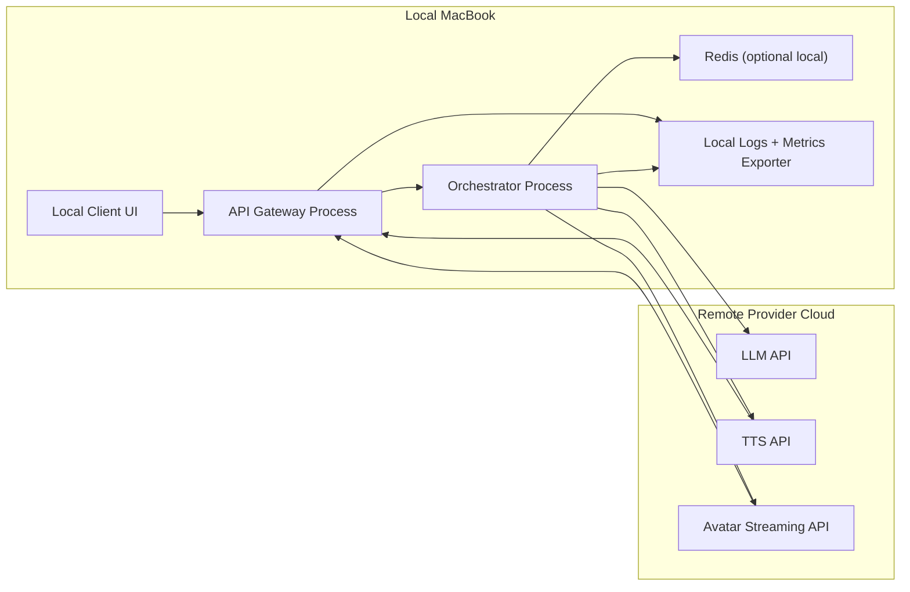

## 10) Interface Contract Map
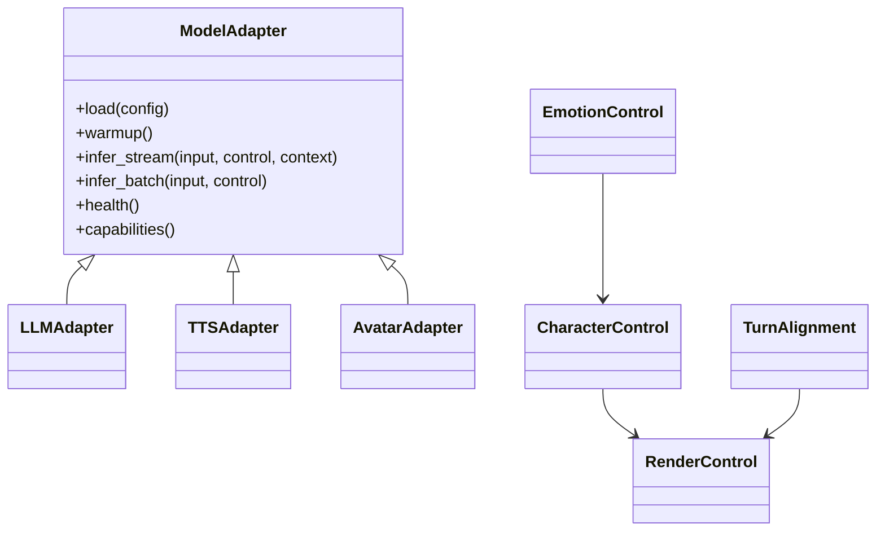

## 11) Overview Reading Order
1. Lean v1 single-service topology.
2. High-level architecture.
3. Component decomposition.
4. Realtime split and managed sequences.
5. Orchestrator internals.
6. Control mapping, failover, and session state machine.
7. Deployment topology.
8. Interface contract map.

## 12) API Gateway Detailed Design
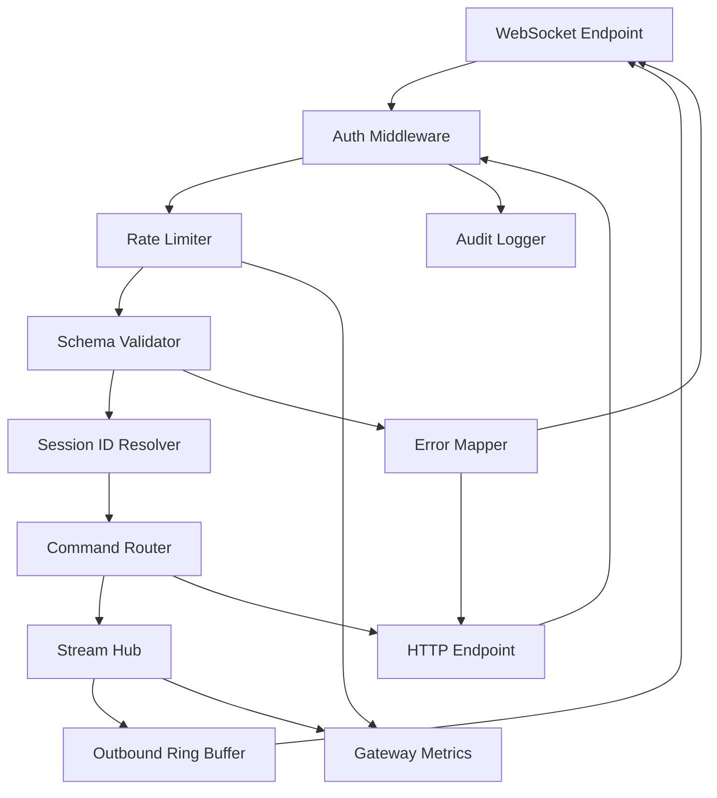

## 13) Orchestrator Concurrency and Queues
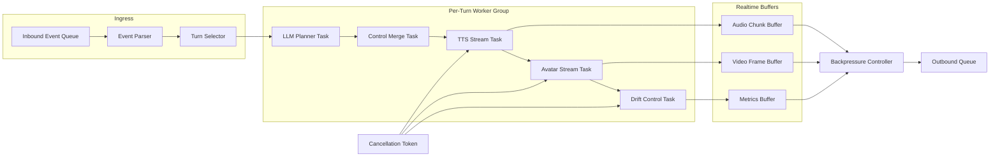

## 14) LLM Component Detailed Flow
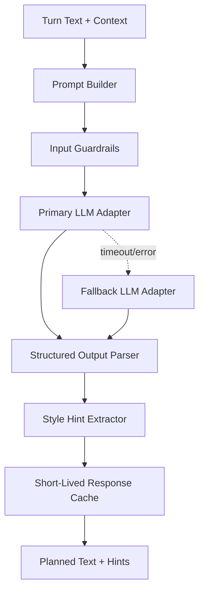

## 15) TTS Component Detailed Flow
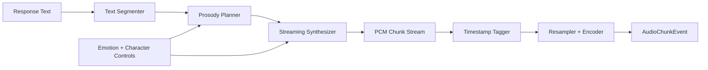

## 16) Avatar Component Detailed Flow
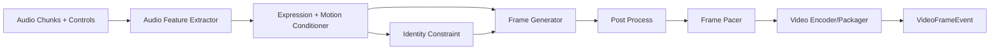

## 17) Alignment and Drift Control Loop
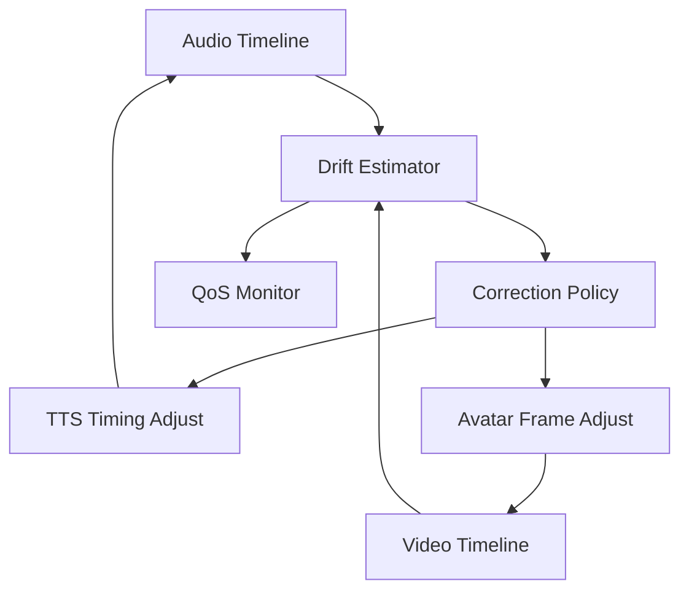

## 18) Provider Circuit Breaker State Machine
```mermaid
stateDiagram-v2
  [*] --> "Closed"
  "Closed" --> "Open": "failure threshold reached"
  "Open" --> "HalfOpen": "cooldown elapsed"
  "HalfOpen" --> "Closed": "probe success"
  "HalfOpen" --> "Open": "probe failure"
```

## 19) Failure Recovery Sequence (Primary to Fallback)
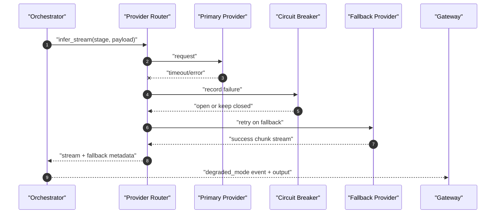

## 20) Data and Observability Pipeline
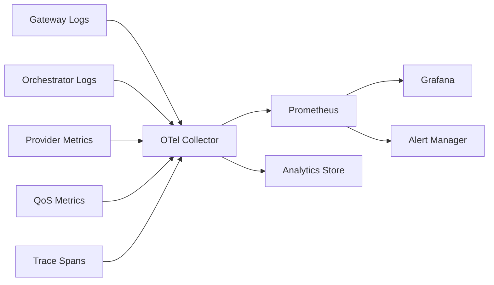

## 21) Security and Trust Boundaries
```mermaid
flowchart TB
  subgraph client_zone["Client Zone"]
    client["Client App"]
  end

  subgraph service_zone["Trusted Service Zone"]
    gw["API Gateway"]
    orch["Orchestrator"]
    secrets["Secrets Manager"]
    policy["Policy Engine"]
  end

  subgraph provider_zone["External Provider Zone"]
    llm["LLM API"]
    tts["TTS API"]
    av["Avatar API"]
  end

  client -->|"TLS + API Key/JWT"| gw
  gw -->|"mTLS/Internal Auth"| orch
  orch -->|"scoped token"| llm
  orch -->|"scoped token"| tts
  orch -->|"scoped token"| av
  gw --> secrets
  orch --> secrets
  orch --> policy
```
